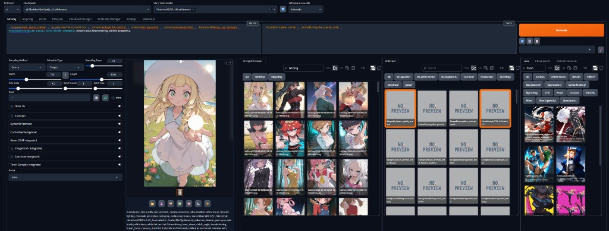
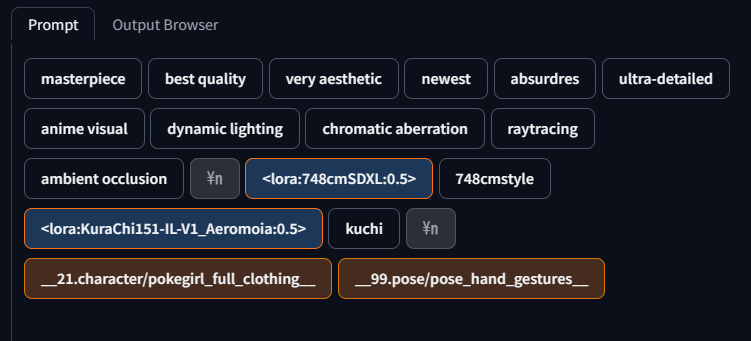
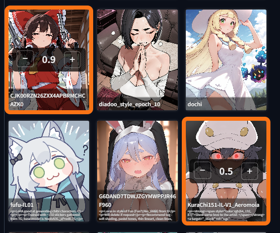

# Forge Split Extra Networks

Designed for Stable Diffusion WebUI Forge - Neo.

Keeps **Generation** for **txt2img / img2img** pinned on the left, with **Checkpoints, LoRA, Textual Inversion, Wildcard, Prompt, Output Browser**, and other Extra Networks on the right—reducing tab switching and making model selection faster. Includes built-in **Prompt**, **Output Browser**, and **Wildcard** tabs, **LoRA card highlight & weight controls**, and optional **1–3 column** horizontal layout; each column has its own tab bar, search bar, and width.




*Preview: Generation on the left; on the right, **three columns side by side**—**Output Browser** (history outputs), **Wildcard** (wildcard cards and categories), and **LoRA** (with Checkpoints / Textual Inversion tabs). Drag between columns to adjust width.*

---

## Features

| Item | Description |
|------|-------------|
| Generation always on the left | Sampling, dimensions, seed, scripts, and gallery stay visible |
| Extra Networks on the right | Checkpoints, LoRA, Textual Inversion, Wildcard, Prompt, Output Browser, and other tabs grouped on the right |
| Multi-column layout (1–3 columns) | Up to **3 horizontal columns** on the right; each column can show selected EN tabs, with independent Search/Sort and resizable width |
| Prompt tab | Visual tag view of the left-side prompt; drag to reorder, double-click to edit, trailing **+** to insert, right-click to remove; LoRA / wildcard tags are color-coded |
| LoRA highlight & weight | Cards for LoRAs already in the prompt show an **orange border** and **− / weight / +** overlay; adjust strength in **0.1** steps without editing text |
| Output Browser | Browse images in the output directory; thumbnail grid with path labels; **single-click** multi-select, **double-click** full-size preview, **right-click** send params / delete |
| Wildcard | Browse wildcard files; **single-click** toggles `__name__` tokens in the prompt; **right-click** opens a line picker to append a single line from a file to the prompt |
| Remember width | Optionally save right-panel / per-column width to browser `localStorage` |
| Non-invasive | Installed under `extensions/` only; does not overwrite core files such as `modules/` or `style.css` |

## Installation

### Method 1: Manual install

1. Copy or download this repository into your WebUI `extensions` directory:

   ```
   <your WebUI root>/extensions/forge-split-extra-networks/
   ```

2. Restart the WebUI, or go to **Settings → Actions → Reload UI**.

3. Under **Settings → Extensions**, confirm `forge-split-extra-networks` is enabled.

### Method 2: Install from URL

1. Open the **Extensions** tab.
2. Choose **Install from URL**.
3. Paste this repository URL:

   ```
   https://github.com/BulbulLeung/forge-split-extra-networks.git
   ```

4. Restart the WebUI after installation.

## Settings

**Settings → Split Extra Networks layout**

| Option | Description | Default |
|------|------|------|
| Enable split layout | Enable or disable the split layout | Enabled |
| Default Extra Networks panel width | Default right-panel width in **single-column mode** (px) | 520 |
| Remember panel width after resize | Whether to remember width after dragging | Enabled |
| Extra Networks preview pane: viewport offset (px) | Vertical padding of the right-panel thumbnail preview relative to the viewport (px); larger values make the panel shorter | 320 |
| Show Output Browser tab in Extra Networks | Whether to show the Output Browser tab | Enabled |
| Show Wildcard tab in Extra Networks | Whether to show the Wildcard tab | Enabled |
| Show Prompt tab in Extra Networks | Whether to show the Prompt tab | Enabled |
| Lora weight button size | Size of the **− / weight / +** overlay on highlighted LoRA cards | Medium |
| Output Browser: maximum number of images to list | Maximum images in the list (newest by modification time) | 500 |
| Output Browser: selection outline width (px) | Highlight border width when a thumbnail is selected with a single click | 5 |
| Output Browser: auto-refresh after txt2img/img2img generation completes | Automatically rescan the Output Browser list after generation completes | Enabled |
| Extra Networks tab order | Tab order on the right (comma-separated) | output browser,prompt,wildcard,lora,checkpoints,textual inversion |
| Default Extra Networks tab on startup | Default tab on startup in **single-column mode** | output_browser |
| **Extra Networks horizontal columns (1–3)** | Number of horizontal columns on the right; `1` is traditional single-column | 1 |
| Default width per column (px, multi-column mode) | Default width per column in **multi-column mode** | 520 |
| Column 1/2/3: Extra Network tabs | Tabs to show in that column (comma-separated slugs; see below) | Column 1: all; columns 2 and 3: empty by default |
| Column 1/2/3: default tab on startup | Default tab on startup for that column | Column 1: output_browser; column 2: lora; column 3: checkpoints |

**Tab slugs (for Column tabs settings)**: `output_browser`, `prompt`, `wildcard`, `lora`, `checkpoints`, `textual_inversion` (display names such as `output browser` also work and are normalized automatically).

After changing enable state, Output Browser, Wildcard, Prompt tab, column count, or tab configuration, **Reload UI** is recommended. Changes to preview pane viewport offset (px) usually take effect immediately; if not, try **Reload UI**.

### Multi-column layout (Column 1–3)

When **Extra Networks horizontal columns** is set to **2** or **3**:

- **Generation** stays on the left; the right side shows **1–3 vertical columns** side by side, each with its own **tab bar**, **Search/Sort toolbar**, and **content area**.
- Use **Column N: Extra Network tabs** to specify which tabs appear in that column (e.g. column 1: `output browser,wildcard`; column 2: `lora`; column 3: `checkpoints`).
- The same tab slug **can be assigned to multiple columns** (tab buttons are cloned), but there is **only one content panel DOM**—it appears in the column where that tab was last selected.
- **Between columns** and **between Generation and the first column**, there are drag handles; each column width is independent (280–2000 px) and can be saved to `localStorage`.
- Each column’s **Search filters only that column’s** cards; filters do not affect other columns.
- When `column_count = 1`, traditional single-column behavior is preserved, using **Default Extra Networks panel width** and **Default Extra Networks tab on startup**.

**Example (2 columns)**

| Setting | Value |
|------|-----|
| horizontal columns | 2 |
| Column 1 tabs | `output browser,wildcard` |
| Column 2 tabs | `lora,checkpoints` |

### Prompt tab

Mirrors the **left-side prompt textarea** as a row of tag buttons in Extra Networks, so you can inspect and edit long prompts without scrolling the text box.



*Preview: **Prompt** tab splits the prompt by commas and line breaks into tags. **LoRA** tokens (`<lora:name:weight>`) use a blue fill with an orange border; **wildcard** tokens (`__path/name__`) use a brown fill with an orange border; `\n` marks a line break.*

#### UI

- **Location**: txt2img / img2img → right-side Extra Networks → **Prompt** tab.
- **Tag layout**: One button per comma-separated segment; each newline in the prompt inserts a `\n` tag between rows.
- **Color coding**: LoRA and wildcard tokens use distinct styles (same colors as in the screenshot above); ordinary prompt text uses the default button style.
- **Two-way sync**: Editing the left prompt textarea updates tags immediately; tag actions write back to the textarea (including token recalculation hooks).

#### Actions

- **Drag** a tag: reorder segments (drop indicator shows insert position).
- **Double-click** a tag: open an **Edit** popover to change that segment's text (type `\n` to keep or insert a line break).
- **Click** the trailing **+** button: open an **Insert** popover to add text after the last tag (supports Local AI translation / `#` prompt generation when enabled).
- **Right-click** a tag: **remove** that segment from the prompt.
- **Ctrl+Z** / **Ctrl+Shift+Z** (or **Cmd** on macOS): undo / redo prompt edits while the Prompt tab is active (local history, up to 16 steps).

### LoRA highlight & weight adjustment

When a LoRA appears in the prompt (`<lora:name:weight>`), its card in the **LoRA** tab is highlighted and shows inline weight controls—no need to edit the prompt string by hand.



*Preview: LoRAs present in the prompt get an **orange selection border**. The overlay shows the current weight; **−** and **+** change it in **0.1** steps and update `<lora:name:weight>` in the prompt.*

#### UI

- **Location**: txt2img / img2img → right-side Extra Networks → **LoRA** tab.
- **Highlight**: Cards matching a LoRA token in the active prompt receive class `forge-en-lora-active` (orange outline).
- **Weight overlay**: On highlighted cards only—**−**, current weight, **+** (step **0.1**; button size: **Settings → Lora weight button size**).

#### Actions

- **− / +**: Decrease or increase that LoRA’s weight in the prompt; overlay and prompt text stay in sync.
- **Click** a highlighted card (outside the overlay): **remove** that LoRA from the prompt (including its activation text suffix, same as the default Extra Networks remove behavior).
- **Add** a LoRA via the normal card click (when not highlighted): unchanged WebUI behavior; the card becomes highlighted and shows the overlay once the token is in the prompt.
- **Edit the prompt** on the left: highlights and displayed weights update automatically.

### Wildcard

Browses wildcard files from [sd-dynamic-prompts](https://github.com/adieyal/sd-dynamic-prompts) (default directory matches Dynamic Prompts; if not installed, falls back to `extensions/sd-dynamic-prompts/wildcards`).

#### UI

- **Location**: txt2img / img2img → right-side Extra Networks → **Wildcard** tab.
- **Search bar**: Filter wildcard cards by filename and path (uses Extra Networks search; in multi-column mode, only filters that column).
- **Folder buttons**: Filter by subdirectory (similar to LoRA and other tabs).
- **Token format**: Follows Dynamic Prompts `dp_parser_wildcard_wrap` in Settings (default `__name__`).

#### Actions

- **Single-click** a card: **add or remove** the corresponding wildcard token in the left **Prompt** (e.g. `__character__`); wildcards already in the prompt are shown with a highlight border.
- When editing the Prompt, highlights **sync both ways** (removing a token from the prompt clears the card highlight).
- **Right-click** a card: open the **line menu** listing each line in the wildcard file; selecting a line **appends it as a new line in the Prompt** (useful for picking a single sentence from a text file instead of the whole `__name__` token).

### Output Browser

#### UI

- **Location**: txt2img / img2img → right-side Extra Networks → **Output Browser** tab (tab order and default on startup can be adjusted in Settings).
- **Search bar**: Filter by filename, relative path, `txt2img/…`, etc. (uses Extra Networks search).
- **Toolbar**: Name/date sort, date filter, **Refresh** (same as LoRA and other tabs; rescans the list).
- **txt2img / img2img buttons**: Quickly filter outputs for that mode (maps to each tab’s samples path in Settings).
- **Thumbnail cards**: Show relative path at the bottom (e.g. `txt2img/2026-02-28/0273-1108391704.png`).

#### Actions

- **Single-click** a card: highlight selection (like a file manager; border width adjustable in Settings); **Ctrl+click** toggles selection, **Shift+click** selects a range from the anchor; **Ctrl+Shift+click** adds a range while keeping existing selection.
- **Double-click** a card: show a large image in a single-image preview layer; **Esc** or click background / close button to dismiss. While preview is open, **← / →** go to previous/next image; **Del** in preview deletes the current image and shows the next (closes if none).
- **Drag and drop** a card onto the left **Prompt**, **gallery**, or **Generation** area: applies PNG info based on the **current main tab** (txt2img main tab → txt2img fields; img2img main tab → img2img fields)—same as right-click **Send to txt2img/img2img**.
- **Drag and drop** onto img2img **Init / Sketch / Inpaint** canvas (ForgeCanvas) on the left: **loads the image** into the currently visible image input, same as Load image; **does not** apply PNG info. Dragging to Prompt/gallery still uses PNG info behavior above.
- **Right-click** a card: context menu
  - **Send to txt2img** / **Send to img2img**: read PNG info from **the right-clicked image**, write to the corresponding tab fields, and switch the main tab (single image only).
  - **Delete**: delete **currently selected** images (if none selected, deletes the right-clicked image); confirmation dialog before delete.
- **Delete key**: when images are selected in the list, **Del** behaves like right-click Delete (does not trigger while typing in an input; in full-size preview, deletes the current image).
- List reloads when clicking **Refresh**, after delete, or on **auto-refresh after generation completes**.
- After each txt2img / img2img generation, Output Browser refreshes by default; disable with “auto-refresh after generation completes” in Settings. **Refresh** remains available anytime.

## Directory structure

```
forge-split-extra-networks/
├── README.md
├── preview.png              # Multi-column layout preview
├── prompt-tab.png           # Prompt tab screenshot
├── lora-weight.png          # LoRA highlight & weight overlay screenshot
├── metadata.ini
├── style.css                # Split / multi-column / prompt & LoRA styles
├── ui_extra_networks_output_browser.py
├── ui_extra_networks_prompt.py
├── ui_extra_networks_wildcard.py
├── javascript/
│   ├── split_extra_networks.js
│   ├── output_browser.js
│   ├── wildcard.js
│   ├── lora.js              # LoRA highlight & weight overlay
│   └── prompt.js            # Prompt tab tags
└── scripts/
    ├── split_extra_networks.py   # Settings and EN tab registration
    ├── output_browser_api.py     # Output Browser infotext / delete API
    └── wildcard_api.py           # Wildcard line-list API
```

## Uninstall

Delete the `extensions/forge-split-extra-networks` folder and restart the WebUI. No changes to core files remain.

## License

Use according to the license included with this repository (if not otherwise stated, MIT or an open-source license compatible with the main project is recommended).

## Acknowledgments

- [Stable Diffusion WebUI Forge - Neo](https://github.com/Haoming02/Stable-Diffusion-Webui-Forge-Neo)
- Automatic1111 / Gradio community Extra Networks UI design
